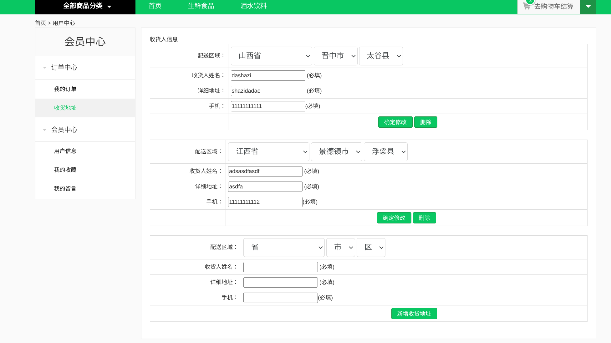
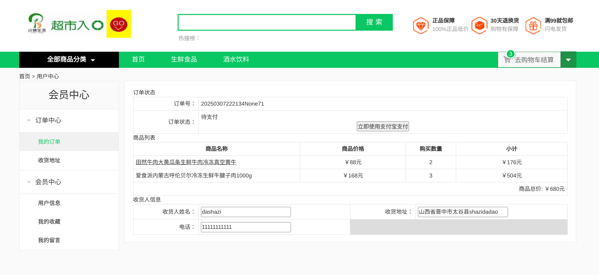
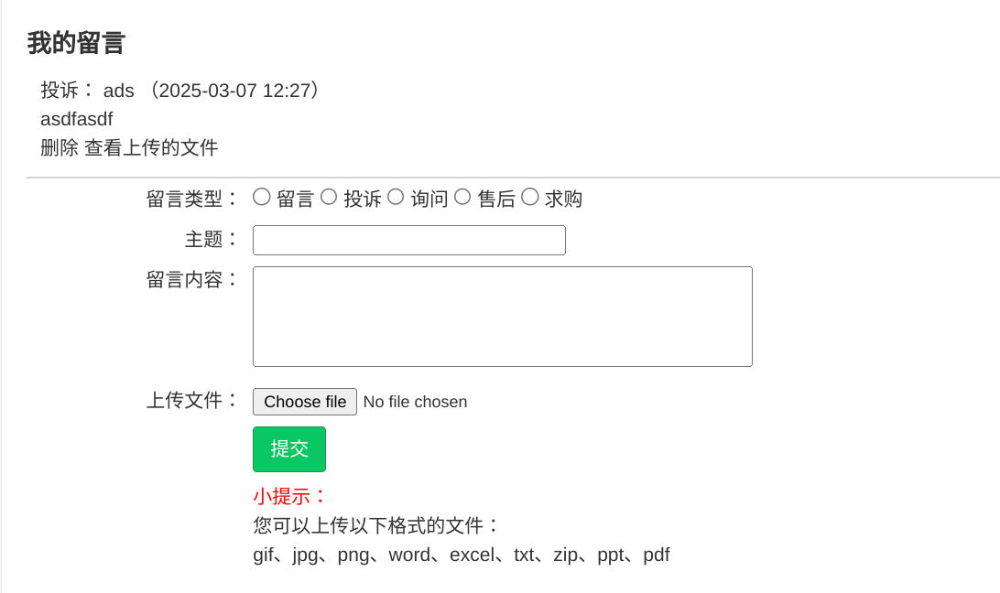

[English](./readme_English.md)

# 简要介绍

你可能已经见过很多的商城后端项目了，这个有什么不同呢？
- 在 2025/03 可以正常运行（Python 3.11.2），摒弃了过时的组件
- 有一个配套的 [前端代码](https://github.com/dropsong/tiny-shop-front)
- 有非常详细的 [开发文档](https://dropsong.github.io/posts/db829e9d.html)，适合复现
- 可以前后端分离，本地运行；也可以部署到云服务器上

通过 Vue + Django REST framework 实现一个电商平台。

此教学项目的完成方式：前端、资源图片等已经准备好了，我负责后端的开发。

权限和认证采用 Authentication 用户认证设置，动态设置 Permission、Authentication，Validators 实现字段验证。

序列化和表单验证使用 Serializer、ModelSerializer，动态设置 Serializer.

实现了支付、登录、注册功能。
- Json Web Token 方式登录，单点登录
- 手机注册 / 支付宝支付
- 第三方账户微博登录

View 实现 REST API
- ApiView / GenericView 方式实现 API 接口
- ViewSet 和 Router 方式实现 API 接口和 URL 配置
- [Django_filter](https://django-filter.readthedocs.io/en/stable/)、SearchFilter、OrderFilter 分页

商品分类、商品详情、导航栏、热销列表、收藏功能、用户个人中心、个人资料修改、用户留言功能、收获地址功能、购物车、订单管理、首页轮播图。

Django REST framework 部分源码阅读。
后台开发文档自动化生成及管理 / 通过 redis 实现缓存。
为实现数据分析的需要，统计了商品点击数、收藏数、库存与销量等。
Throttling 对用户和 IP 进行限速，实现反爬虫。
Sentry 完成线上系统的错误日志的监控和告警。

# 环境准备

系统：debian12
数据库：mysql  Ver 8.4.4 for Linux on x86_64 (MySQL Community Server - GPL)

注意，在 debian 上需要先卸载 MariaDB，否则会产生冲突。

使用的第三方： 
- [DjangoUeditor](https://github.com/zhangfisher/DjangoUeditor)
  这个 DjangoUeditor 版本众多，多数已经过时了，与 Django 4.2 不兼容。我改动了一点代码，使这个项目可以运行，但也许还有其他潜在的错误。
- [social-core](https://github.com/python-social-auth/social-core)
- [djangorestframework-simplejwt](https://github.com/jazzband/djangorestframework-simplejwt)
  rest_framework_jwt 已经不再维护，故迁移到此。

# 界面展示

网站首页：

商品详情页：

结算页面：

个人中心，收货地址：

个人中心，我的订单（点击订单号可以进入支付页面）：

我的收藏：

留言系统：

