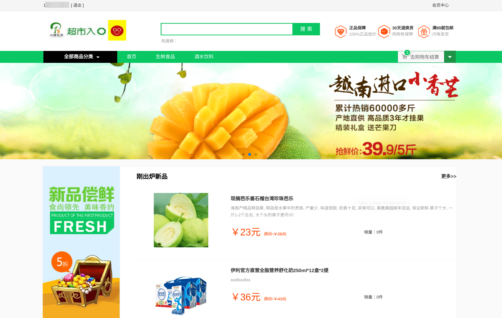
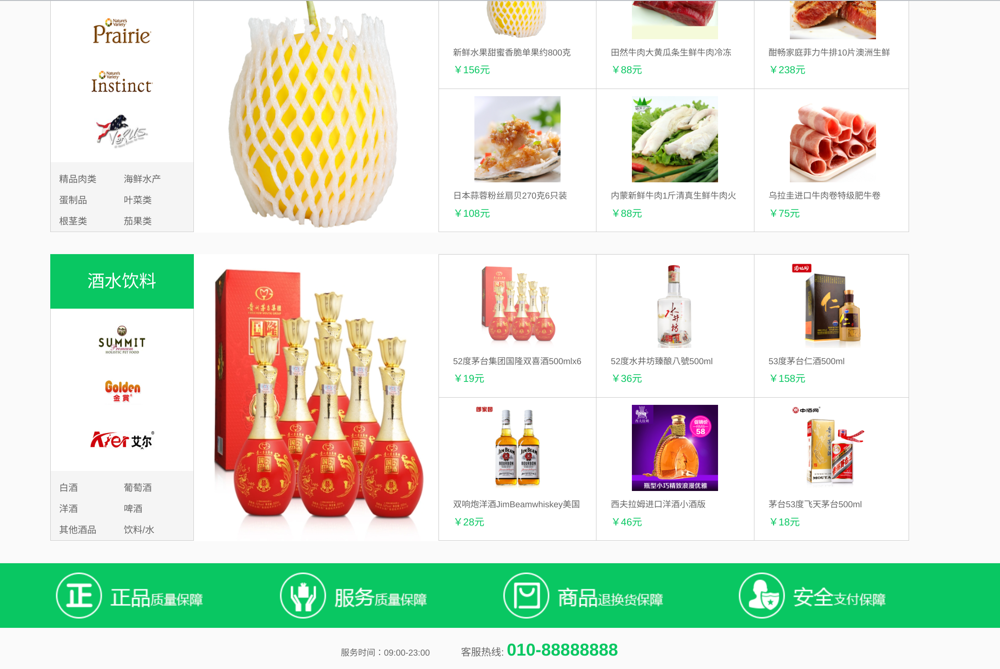
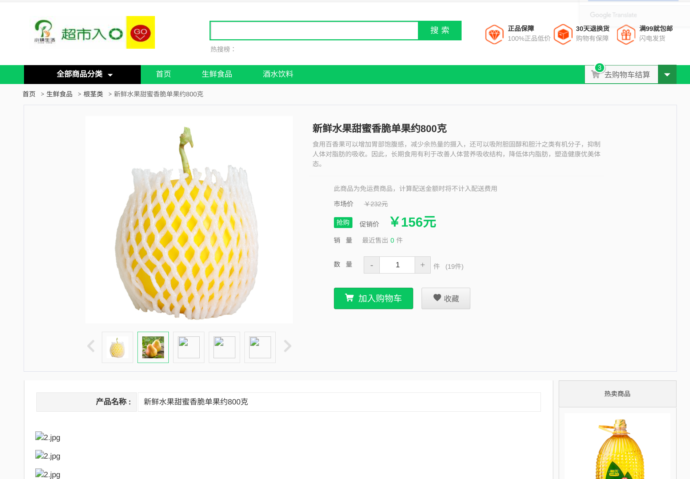
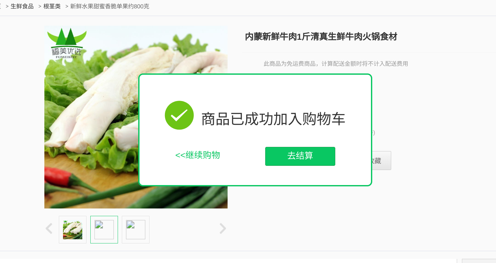
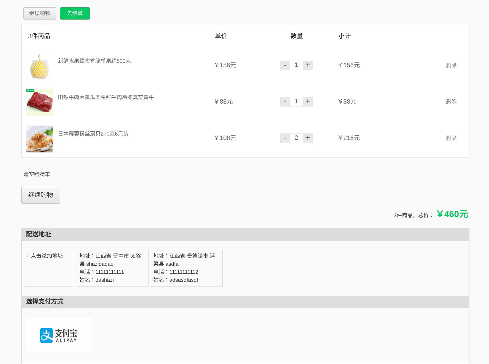
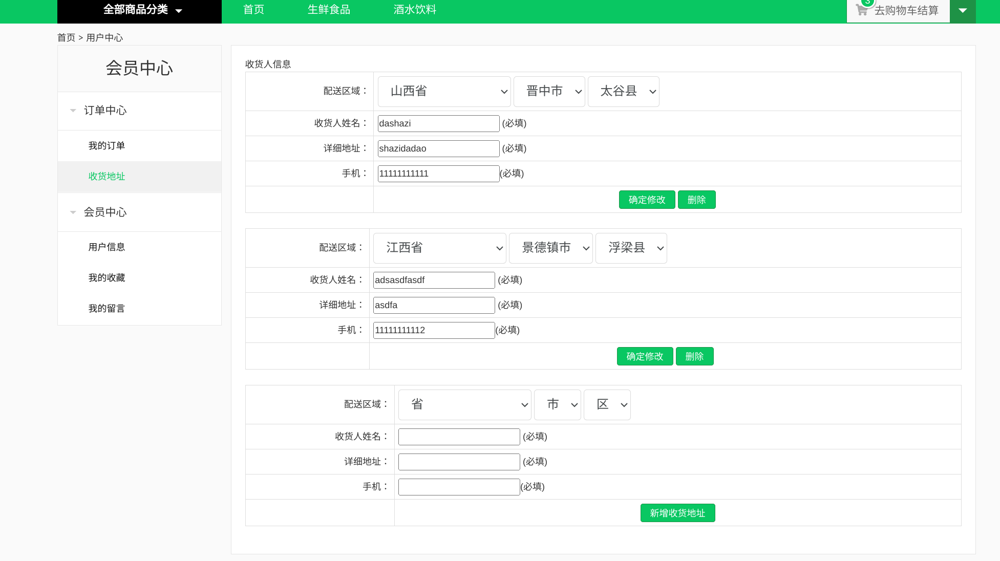
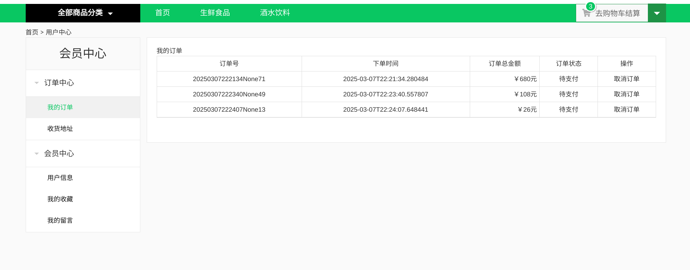
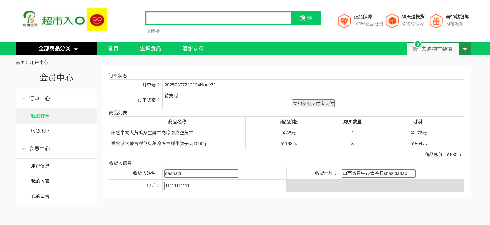
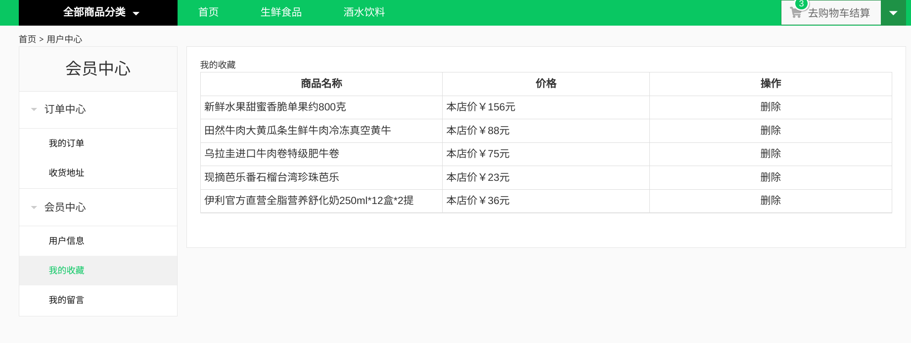
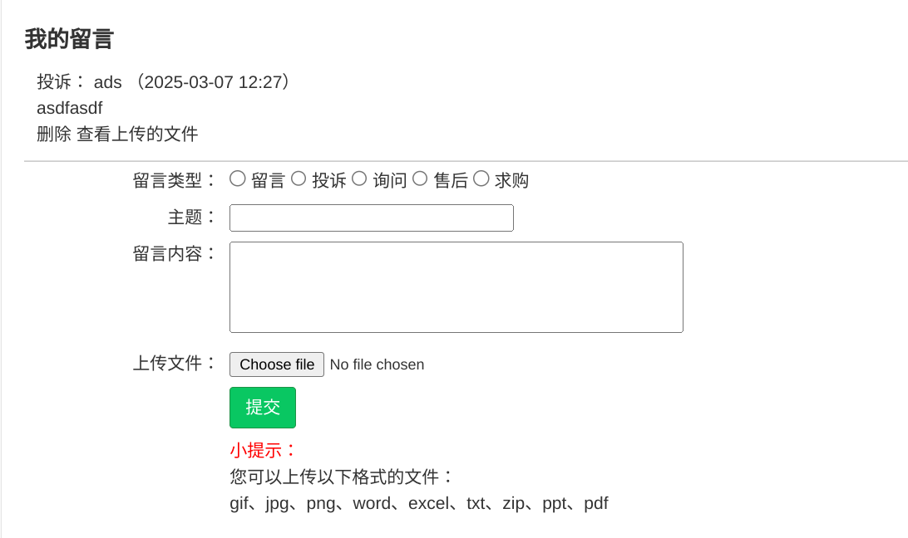

# Brief Introduction

You may have seen many e-commerce backend projects before, so what makes this one different?
- It runs smoothly as of March 2025 (Python 3.11.2), abandoning outdated components.
- It comes with a matching [frontend codebase](https://github.com/dropsong/tiny-shop-front).
- It has very detailed [development documentation](https://dropsong.github.io/posts/db829e9d.html), suitable for replication.
- Supports separation of frontend and backend, running locally; it can also be deployed to a cloud server.

This project implements an e-commerce platform using Vue + Django REST framework.

How this tutorial project was completed: The frontend, resource images, etc., were already prepared, and I was responsible for backend development.

Authentication and permissions are implemented using Authentication user authentication settings, dynamically configuring Permission, Authentication, and Validators for field validation.

Serialization and form validation are handled using Serializer and ModelSerializer, with dynamic Serializer configuration.

Implemented payment, login, and registration functions:
- JSON Web Token login method, single sign-on.
- Mobile registration / Alipay payment.
- Third-party account login via Weibo.

View implements REST API:
- API interfaces implemented using ApiView / GenericView.
- API interfaces and URL configuration implemented using ViewSet and Router.
- Pagination with [Django_filter](https://django-filter.readthedocs.io/en/stable/), SearchFilter, and OrderFilter.

Features include product categories, product details, navigation bar, hot sales list, favorites function, user personal center, profile modification, user messaging, shipping address management, shopping cart, order management, and homepage carousel.

Partial source code reading of Django REST framework.  
Automated generation and management of backend development documentation / caching implemented via Redis.  
For data analysis needs, statistics on product clicks, favorites, stock, and sales were collected.  
Throttling limits requests by user and IP to prevent scraping.  
Sentry is used for error log monitoring and alerts in the production system.

# Environment Setup

System: Debian 12  
Database: MySQL Ver 8.4.4 for Linux on x86_64 (MySQL Community Server - GPL)

Note: On Debian, you need to uninstall MariaDB first, otherwise conflicts will occur.

Third-party libraries used:
- [DjangoUeditor](https://github.com/zhangfisher/DjangoUeditor)  
  There are many versions of DjangoUeditor, most of which are outdated and incompatible with Django 4.2. I made some code modifications to make this project work, but there may still be potential issues.
- [social-core](https://github.com/python-social-auth/social-core)
- [djangorestframework-simplejwt](https://github.com/jazzband/djangorestframework-simplejwt)  
  `rest_framework_jwt` is no longer maintained, so I migrated to this.

# Interface Showcase

Website Homepage:

Product Details Page:

Checkout Page:

Personal Center, Shipping Address:

Personal Center, My Orders (Clicking the order number takes you to the payment page):

My Favorites:

Messaging System:

